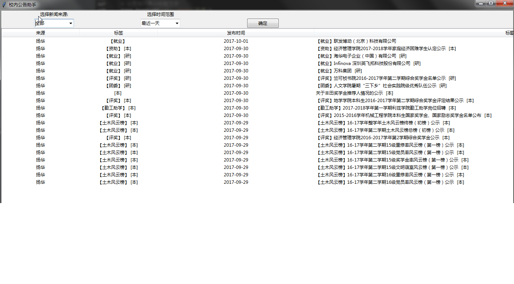

# 校园公告助手

## 功能简介
- 可根据公告来源、发布时间查看学校教务网、扬华网和信息学院网站公告
- 定时检查校园网是否有新的公告，当有新的公告时，窗口自动弹出
- 程序连续运行一小时（连续学习了一小时后），弹窗提醒休息

## 使用

### 环境 安装了Python3的Windows、Mac、Linux

### 步骤
- 下载代码
- Windows用户执行`run.bat`文件
- 根据命令行提示安装相应模块 eg. `pip3 install tkinter`
- 直到没有错误提示为止即可

